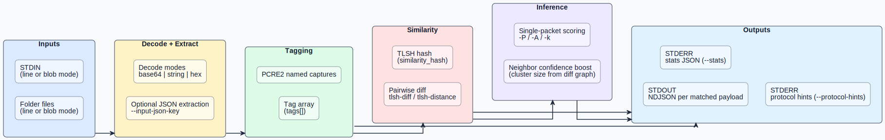

# precursor

<p align="center">
  
</p>

`precursor` is a CLI for **pre-protocol payload tagging + similarity clustering**.
It combines PCRE2 named-capture matching, TLSH/LZJD similarity, optional MRSHv2 adapter mode, and JSON outputs that are easy to feed into detection engineering and LLM-assisted protocol discovery loops.
Project page: https://precursor.hashdb.io

## Release 0.2.0 Highlights

| Area | What landed |
| --- | --- |
| Packet Inference | Single-packet protocol scoring via `-P` / `-A` / `-k` |
| Blob Processing | `-z, --input-blob` for multiline or stream-as-one-record analysis |
| Similarity Workflows | TLSH or LZJD clustering + protocol hints (`--protocol-hints`) for discovery loops |
| Output Contract | Stable `protocol_*`, `similarity_hash`, `tags`, `xxh3_64_sum` JSON fields |
| Reliability | Runtime ingest path no longer relies on panic-prone `expect(...)` calls |
| Scenario Corpus | Versioned packet/firmware/ICS samples in `samples/scenarios/` |
| Release Ops | Dependency auto-bump/tag workflows + benchmark harness + Pages site |

> [!IMPORTANT]
> **Known limitation:** in blob mode (`-z`), raw bytes are fully supported in `string` mode, while `base64` and `hex` blob decoding currently expects UTF-8 wrapper text.

## 60-second teaser

```bash
cat samples/scenarios/pre-protocol-packet-triage/payloads.b64 \
  | precursor -p samples/scenarios/pre-protocol-packet-triage/patterns.pcre \
      -m base64 -t -d --similarity-mode lzjd -P --protocol-hints
```

Representative output shape:

```json
{
  "tags": ["http_method"],
  "similarity_hash": "lzjd:128:...",
  "protocol_label": "http",
  "protocol_confidence": 0.93,
  "protocol_candidates": [
    {"protocol": "http", "score": 0.93, "evidence": ["matched HTTP request/headers"]}
  ],
  "xxh3_64_sum": "..."
}
```

Why this matters:
- Fast pre-protocol triage when DPI/parsers are unavailable.
- Stable JSON fields for SOC pipelines and enrichment tooling.
- Built-in cluster context for LLM-assisted protocol discovery.

## Best Fit

- Rapid triage of payload lines from logs, brokers, sensors, or ad-hoc captures.
- Label-first workflows where regex capture names become downstream tags.
- Similarity-first clustering when full protocol parsers are unavailable or too brittle.
- Early-stage protocol discovery where hints are fed to humans or LLM tooling.

## Non-Goals

- Not a replacement for full IDS/NSM stacks (Suricata, Zeek).
- Not a malware rule engine replacement (YARA / YARA-X).
- Not yet a full raw-binary parser framework; blob mode currently expects UTF-8 wrappers for `base64`/`hex` decode modes.

## Architecture

<p align="center">
  
</p>

## Install

### Cargo

```bash
cargo install precursor
```

### From source

```bash
git clone https://github.com/Obsecurus/precursor.git
cd precursor
cargo build --release
./target/release/precursor --help
```

Release archives include generated shell completion files (`bash`, `fish`, `zsh`, `powershell`) and a `precursor.1` man page.

### Optional: Build with MRSHv2 adapter mode

```bash
mock_dir="$(mktemp -d)"
ci/build_mrshv2_mock.sh "$mock_dir"
PRECURSOR_MRSHV2_LIB_DIR="$mock_dir" cargo build --features similarity-mrshv2
```

## Quick start

### 1) Match string payloads from stdin

```bash
printf 'hello world\nbye world\n' \
  | precursor '(?<hello_tag>hello)' -m string
```

### 2) Match base64 payloads

```bash
printf 'aGVsbG8gd29ybGQ=\n' \
  | precursor '(?<hello_tag>hello)' -m base64
```

### 3) Load patterns from file

```bash
printf 'aGVsbG8gd29ybGQ=\n' \
  | precursor -p patterns/new -m base64
```

### 4) Extract payload from JSON before matching

```bash
printf '{"payload":"aGVsbG8gd29ybGQ="}\n' \
  | precursor '(?<hello_tag>hello)' -j '.payload' -m base64
```

### 5) Enable similarity diffing (TLSH default)

```bash
cat payloads.b64 \
  | precursor -p patterns/new -m base64 -t -d -x 80
```

### 6) Switch to LZJD similarity mode

```bash
cat payloads.raw \
  | precursor -p patterns/new -m string -t -d --similarity-mode lzjd -x 80
```

### 7) Emit protocol-discovery hints for an LLM loop

```bash
cat payloads.b64 \
  | precursor -p patterns/new -m base64 -t -d --protocol-hints --protocol-hints-limit 20
```

### 8) Enable single-packet protocol inference output

```bash
cat payloads.b64 \
  | precursor -p patterns/new -m base64 -P -A 0.7 -k 5
```

### 9) Match a multiline payload as one blob

```bash
printf 'GET /blob HTTP/1.1\nHost: blob.example\n' \
  | precursor '(?<multi>GET /blob HTTP/1\.1\nHost: blob\.example)' -m string -z
```

## CLI reference

```text
precursor [PATTERN] [OPTIONS]
```

Pattern source:
- positional `PATTERN` (single named-capture regex)
- `-p, --pattern-file <PATH>` (one named-capture pattern per line)

Input:
- `-f, --input-folder <PATH>`: read newline-delimited content from files
- stdin: read newline-delimited input from standard input
- `-z, --input-blob`: process each input source as one blob instead of line splitting
- `-m, --input-mode <base64|string|hex>`: decode mode (default: `base64`)
- `-j, --input-json-key <QUERY>`: extract payload from JSON input first

Similarity:
- `-t, --tlsh`: compute TLSH hash for matched payloads
- `-d, --tlsh-diff`: compute pairwise TLSH distance among matched payloads
- `-a, --tlsh-algorithm <48_1|128_1|128_3|256_1|256_3>`
- `-x, --tlsh-distance <N>`: max distance threshold (default: `100`)
- `-l, --tlsh-length`: include payload length in diff scoring
- `-y, --tlsh-sim-only`: only output payloads that have TLSH similarities
- `--similarity-mode <tlsh|lzjd|mrshv2|fbhash>`:
  - `tlsh` and `lzjd` are implemented in default builds
  - `mrshv2` is implemented behind `--features similarity-mrshv2` and native adapter linking
  - `fbhash` remains scaffolded
- `--protocol-hints`: emit LLM-oriented protocol-discovery hint JSON to `stderr`
- `--protocol-hints-limit <N>`: limit hint candidate count (default: `25`)
- `-P, --single-packet`: enable heuristic protocol inference on each matched payload
- `-A, --abstain-threshold <0.0-1.0>`: minimum confidence required to emit a non-`unknown` label (default: `0.65`)
- `-k, --protocol-top-k <N>`: candidate count included in `protocol_candidates` (default: `3`)

Other:
- `-s, --stats`: emit run statistics JSON to `stderr`

## Output model

Each matched payload is emitted as JSON on `stdout` with fields such as:
- `tags`: array of matched capture names
- `tlsh`: active similarity hash when enabled (legacy field name preserved for compatibility)
- `similarity_hash`: backend-agnostic similarity hash field
- `xxh3_64_sum`: stable payload key for report correlation
- `tlsh_similarities`: distance map when `--tlsh-diff` is enabled
- `protocol_label`: top protocol guess (or `unknown` when abstaining)
- `protocol_confidence`: confidence score for `protocol_label`
- `protocol_abstained`: whether inference abstained under threshold
- `protocol_candidates`: scored candidate list with evidence strings

When `--stats` is enabled, a summary JSON object is emitted to `stderr`.
When `--protocol-hints` is enabled, an additional hint JSON block is emitted to `stderr` for LLM-guided protocol discovery workflows, including `protocol_*` fields when single-packet inference is enabled.
When both `--single-packet` and `--tlsh-diff` are enabled, protocol confidence is cluster-boosted using similarity neighbor counts.
When `--input-blob` is enabled, each file/stdin stream is treated as a single candidate payload.

## Positioning vs adjacent tools

- Use **Suricata/Zeek** for full protocol-aware IDS/NSM and rich ecosystem integrations.
- Use **YARA/YARA-X** for signature-based scanning of files and malware-centric workflows.
- Use **Precursor** when you need lightweight, custom payload tagging plus TLSH/LZJD similarity in one CLI pipeline.

## Scenario corpus and demos

- Scenario corpus: `samples/scenarios/`
- Demo runner: `samples/scenarios/run_all.sh`
- Static demo site source: `site/`

```bash
samples/scenarios/run_all.sh ./target/release/precursor
```

## Benchmarks

Generate a reproducible scenario snapshot:

```bash
cargo build --release
ci/benchmark_scenarios.sh ./target/release/precursor benchmarks/latest.md
```

Committed baseline:
- `benchmarks/baseline-2026-02-13.md`

## GitHub Pages + precursor.hashdb.io

- Pages workflow: `.github/workflows/pages.yml`
- Site content: `site/`
- Custom domain file: `site/CNAME`
- Configure DNS at your provider with:
  - record type: `CNAME`
  - host: `precursor`
  - value: `obsecurus.github.io`

## Current roadmap

See `ROADMAP.md` for prioritized milestones and release criteria.
See `SIMILARITY_BACKENDS.md` for MRSHv2/FBHash feasibility and backend sequencing.

## Development

```bash
cargo fmt --all --check
cargo test --workspace
mock_dir="$(mktemp -d)"
ci/build_mrshv2_mock.sh "$mock_dir" >/dev/null
PRECURSOR_MRSHV2_LIB_DIR="$mock_dir" LD_LIBRARY_PATH="$mock_dir:${LD_LIBRARY_PATH:-}" cargo test --workspace --features similarity-mrshv2
```

CI currently tests multiple toolchains and targets, including a pinned Rust `1.86.0` lane.
Dependabot is configured for weekly Cargo and GitHub Actions updates, with auto patch-version bump + auto-tag workflows so dependency updates can flow into release builds.

## Background

- GreyNoise blog: https://www.greynoise.io/blog/precursor-a-quantum-leap-in-arbitrary-payload-similarity-analysis
- GreyNoise Labs writeup: https://www.labs.greynoise.io/grimoire/2023-10-11-precursor/

## License

Dual-licensed under MIT and Unlicense.
